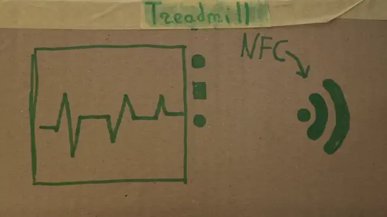

# Apple GymKit 

<p float="left">
 
</p>

# Notes

⚠️GymKit reverse-engineering information presented here is very limited and does not allow to implement the specification. The goal of this document is to provide a starting point for people that plan on researching this technology, in order to save their time and help with collaboration.

Protocol research stopped at the BLE pairing step as I wasn't able to implement proper pairing. Further research after that might require one to have real hardware samples in order to look at BLE communication and find out what data needs to be sent and received.

# Overview

GymKit is a technology that allows connecting your Apple Watch to a supported gym equipment, enabling both devices to share telemetry data to improve data quality and overall user experience.

Pairing is done using NFC BLE handover. Apple Watch will only enter pairing mode if the NFC reader implements ECP, otherwise it won't respond to polling.  

# Flow

1. The implementing device should do ECP GymKit poll either in background at all times, or after an appropriate option has been activated via available interface;
2. As the watch approaches the reader, upon detecting GymKit ECP frames it turns on HCE and starts emulating a type 4 nfc tag, containing BLE pairing information inside of an NDEF message;
3. Using the retreived pairing info, device connects to the watch;
* Further steps have not been researched and are just my assumptions;
4. Gym device might have to perform MFI challenge using an apple-licensed chip;
5. After successful authentication, watch and gym equipment start sharing telemetry data via BLE GATT.

# NFC

## ECP

ECP is mandatory to trigger GymKit, as in all other instances the watch does not respond to polling.

The ECP frame used for triggering GymKit is:  
`
6a01c30000
`

## Selection

After seeing an ECP frame, a 10-15 second grace period starts on a watch, where it will respond to a WUPA command.

After anticollision, a tag with following parameters has to be selected:
```
 SAK: 20 
 UID: 00010203
ATQA: 0200
 ATS: 0578807100
```

The UID `00010203` is used by Apple devices in other situations where they implement a handover. It may serve as a way of detecting that you've actually selected a watch intended to pair via gymkit.

## NDEF Payload

Pairing watch emulates a Type 4 NFC tag, application ID to be selected is `D2760000850101`. Info on reading this tag type is available on the web and won't be described here as it's not the main topic.

After reading the data you'll get an NDEF message containing a single 102-byte record with following information:

 | Field name  | Length | Value                                   | Notes                                                                                          |
 | ----------- | ------ | --------------------------------------- | ---------------------------------------------------------------------------------------------- |
 | NDEF HEADER | 3      | `D2273C`                                | TNF = 2: MIME Record                                                                           |
 | Type        | 39     | application/vnd.bluetooth.secure.le.oob | Similar to other BLE OOB pairing payload types, although they lack the "vnd" and "secure" part |
 | ID          | 0      | (Empty)                                 |                                                                                                |
 | Payload     | 60     | (Dynamic)                               | Contains a BLE EIR container                                                                   |


## BLE EIR Data

NDEF Record payload contains a 60-byte-long BLE EIR container with following fields:

 | Field name      | ID   | Length | Value                  | Notes                                                                         |
 | --------------- | ---- | ------ | ---------------------- | ----------------------------------------------------------------------------- |
 | ROLE            | `1c` | 1      | `01`                   |                                                                               |
 | LE_SC_RANDOM    | `23` | 16     | (Dynamic)              |                                                                               |
 | LE_SC_CONFIRM   | `22` | 16     | (Dynamic)              |                                                                               |
 | LOCAL_NAME_FULL | `09` | 8      | (Dynamic)              |                                                                               |
 | MAC_ADDRESS     | `1b` | 7      | `XX XX XX XX XX XX 01` | First 6 bytes is a MAC-address, last one is address type (random static - `01`) |
    
 At this point he aquired BLE data has to be used to establish connection to a watch. Furhter steps are unknown. 


# Examples

## BLE Handover

```
GOT TAG:
SAK: 20 00100000
UID: 00010203
ATQ: 0200
ATS: 0578807100

SELECT NDEF: 
    CMD = ISO7816Command(cla=0x00; ins=0xa4; p1=0x04; p2=0x00; lc=7; data=d2760000850101; le=0)
    RES = ISO7816Response(sw1=0x90; sw2=0x00)
SELECT NDEF CAPS FILE:
    CMD = ISO7816Command(cla=0x00; ins=0xa4; p1=0x00; p2=0x0c; lc=2; data=e103; le=0)
    RES = ISO7816Response(sw1=0x90; sw2=0x00)
READ NDEF CAPS FILE:
    CMD = ISO7816Command(cla=0x00; ins=0xb0; p1=0x00; p2=0x00; le=15)
    RES = ISO7816Response(sw1=0x90; sw2=0x00; data=000f2000ff00ff0406e104200000ff(15))
SELECT NDEF DATA FILE:
    CMD = ISO7816Command(cla=0x00; ins=0xa4; p1=0x00; p2=0x0c; lc=2; data=e104; le=0)
    RES = ISO7816Response(sw1=0x90; sw2=0x00)
READ NDEF DATA FILE LENGTH: 
    CMD = ISO7816Command(cla=0x00; ins=0xb0; p1=0x00; p2=0x00; le=2)
    RES = ISO7816Response(sw1=0x90; sw2=0x00; data=0066(2))
READ NDEF DATA FILE:
    CMD = (2 -> 104) ISO7816Command(cla=0x00; ins=0xb0; p1=0x00; p2=0x02; le=102)
    RES = ISO7816Response(sw1=0x90; sw2=0x00; data=d2273c6170706c69636174696f6e2f766e642e626c7565746f6f74682e7365637572652e6c652e6f6f623c00021c011123c4a5180bf523c0ae5edf6740a697c0ba1122fe745463b20297cc1f94e63725ced9320909e6b4dd25c52c5cbf081bb39dcb7be95001(102))

NDEFRecord(
  tnf=2,
  type=6170706c69636174696f6e2f766e642e626c7565746f6f74682e7365637572652e6c652e6f6f62,
  id=,
  payload=3c00021c0111234448007cb24c1c81e1a18c9a4246d1091122f917773d6178f04297abbb056b2d2c370909b657c3295fcf569e081bb5b9f351d27501
)

BLEEIRContainer(
  ROLE                    : 01                              
  LE_SC_RANDOM            : c4a5180bf523c0ae5edf6740a697c0ba
  LE_SC_CONFIRM           : fe745463b20297cc1f94e63725ced932
  LOCAL_NAME_FULL         : e6b4dd25c52c5cbf                
  MAC_ADDRESS             : b39dcb7be95001                  
)
```

# Experimenting

One of the ways you can play around with GymKit is by using a device such as Proxmark3.

In order to trigger GymKit:
1. Tap your watch to Proxmark
2. Execute the command `hf 14a raw -akc 6a01c30000` 3 times;
3. A) To look at NDEF info, execute `nfc type4a read -v` command;  
   B) To do the read manually, you can use `hf 14a apdu -k` command with appropriate steps.


# Notes

- If you find any mistakes/typos or have extra information to add, feel free to raise an issue or create a PR.


# References
* Resources that helped with research:
  - Learning material:
    - [Introducing NDEF](https://www.oreilly.com/library/view/beginning-nfc/9781449324094/ch04.html);
    - [ndeflib - Bluetooth SSP](https://ndeflib.readthedocs.io/en/stable/records/bluetooth.html);
* Devices and software used for analysis:
  - Proxmark3 Easy - used to try out NDEF commands and ECP. Proxmark3 RDV2/4 can also be used;
  - [Proxmark3 Iceman Fork](https://github.com/RfidResearchGroup/proxmark3) - firmware for Proxmark3.
  - PN532 used to implement test reader.
